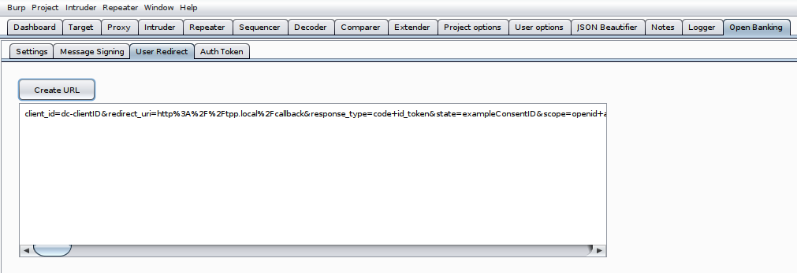

# Open Banking Burp Extension

This Burp Suite extension can be used to complete the Open Banking user flow. It includes the following features:

- Message Singing
- User Redirect Generator
- Authorisation Token Callback


Please refer to our tooling blog post series for an intro into Open Banking and Read/Write API tooling:

- Open Banking - Open for Business: https://www.contextis.com/en/blog/open-banking-open-for-business
- Open Banking Challenges: https://www.contextis.com/en/blog/open-banking-the-challenges
- Open Banking Read/Write API Tooling: https://www.contextis.com/en/blog/open-banking-read-write-api-tooling


## Requirements

This project requires 

- JDK 11
- Gradle 4 or higher
- Public and private key in DER format


## Build Project

Use `gradle` or `./gradlew` to build the project

```bash
gradle clean
gradle build
```

Import the java library from the project sub folder `build/libs` into Burp Suite. This will add a new main tab to the application.


## Demo

<video src="img/open-banking-burp-extension-demo.mp4"></video>
The demo was created with an ASPSP and TPP stub. The stubbed web server has been included within the project resources in "src/main/test/resources/OpenBanking-Test-Server.py" and the example configuration has also been included in the same folder - "open-banking-example-burp-config.json". 


Note: 

- The path for the private and public keys has not been added and needs to be done manually.
- The `hosts` file was used to define "aspsp.ctx" and "tpp.ctx" for the loopback address (127.0.0.1)


OpenBanking-Test-Server.py - Available endpoints:

| Method | Endpoint                                          | Description                                                  |
| ------ | ------------------------------------------------- | ------------------------------------------------------------ |
| GET    | http://aspsp.ctx/pisp/domestic-payment-consents/1 | Example PISP GET endpoint                                    |
| GET    | http://aspsp.ctx/ob/login                         | This endpoint represents a login page for a bank             |
| GET    | http://tpp.ctx/redirect                           | This endpoint allows a tester to manually trigger the callback (Auth Token) |
| GET    | http://tpp.ctx/callback                           | This is a dummy page for after the callback                  |
| POST   | http://aspsp.ctx/pisp/domestic-payment-consents   | Example PISP POST endpoint.                                  |
| POST   | http://aspsp.ctx/token.oauth2                     | This endpoint represents the OAuth endpoint of an ASPSP.     |


## Feature Details

The "Open Banking" tab includes subsections for settings, message signing, redirect generation and the OAuth callback (Auth Token).


### Settings

The settings tab holds the configuration for all of the different features of the extension.


Here are the settings with additional information:

| Setting                         | Feature                                | Info                                                         |
| ------------------------------- | -------------------------------------- | ------------------------------------------------------------ |
| ALG                             | Message Signing & User Redirect        | Open Banking specifies either PS256 (preferred) or RS256. This may depend on the bank's implementation. |
| KID                             | Message Signing & User Redirect        | Certificate Key ID                                           |
| Private Key                     | Message Signing & User Redirect        | The absolute path to the private signing key in DER format.  |
| Public Key                      | Message Signing & User Redirect        | Optional to verify the signing - The absolute path to the public signing key (not certificate) in DER format. |
| ISS                             | Message Signing                        | This must be a string that identifies the TPP, therefore the "Client ID" is often used for this. |
| Message Signing Endpoints       | Message Signing                        | Enter the URLs message signing should be enabled for separated by commas |
| TAN                             | Message Signing                        | Must be a domain name that is registered to and identifies the Trust Anchor (the value set is the default). |
| Crit                            | Message Signing                        | This field must consist of the following values: b64, http://openbanking.org.uk/iat, http://openbanking.org.uk/iss,http://openbanking.org.uk/tan |
| Typ                             | Message Signing                        | **Optional Value** - if set must be "JOSE"                   |
| Cty                             | Message Signing                        | **Optional Value** - if set must be "application/json"       |
| Client ID                       | User Redirect & Authorisation Callback | This is the TPP identifier.                                  |
| Scope                           | User Redirect & Authorisation Callback | The scope for the access request; PISP = payments, AISP = accounts, CBPII = fundsconfirmations; openid is always set. |
| Redirect                        | User Redirect & Authorisation Callback | The TPP redirect URL. This is the endpoint for the callback. |
| OAuth URL                       | User Redirect & Authorisation Callback | The URL for the OAuth endpoint to get the bearer token after the user has authorised the action. |
| Consent ID                      | User Redirect                          | The current consent ID. This value needs to be changed with every new consent. |
| Response Type                   | User Redirect                          | The response type for the authorised bearer token.           |
| State                           | User Redirect                          | This needs to be a random value, banks often use the consent ID |
| Audience                        | User Redirect                          | This is the redirect URL for the bank, where the user needs to authenticate to the bank and authorise the action. |
| Nonce                           | User Redirect                          | This needs to be a random value, banks often use the consent ID |
| Use ConsentId for Nonce & State | User Redirect                          | Tick this box, to use the consent ID for the Nonce and State fields. |

The public and private key fields require the absolute path to the key files in DER format. Below are some conversions for the public and private key as they are required for the tool.

- Public certificate in PEM format to public key in DER format:

```bash
# PEM certificate to PEM public key
openssl x509 -pubkey -noout -in cert.pem  > pubkey.pem

# PEM public key to DER public key: 
openssl rsa -pubin -inform PEM -in pubkey.pem -outform DER -out pub-key.der
```

- Private key in PEM format to private key in DER format:

```bash
openssl pkcs8 -topk8 -nocrypt -in signing.key -outform der -out priv-key.der
```


### Message Signing

**Note:** Our message signing implementation has not been tested yet. There is currently a waiver for TPPs and ASPSPs not to enable message signing. Therefore there may be problems with the message signature that we don't know of yet. 

- https://openbanking.atlassian.net/wiki/spaces/DZ/pages/1112670669/W007


The extension offers automatic and manual message signing functions. The automatic signing is enabled when one or more URLs are entered into the "Message Signing Endpoints" field. Any requests to the specified endpoints sent through the repeater and intruder are automatically signed. 

Burp will not show the actual request sent out, therefore please use the "Custom Logger" Burp Suite extension or similar to view the updated requests:

- https://github.com/PortSwigger/custom-logger

Manual signing can be done by copy/pasting the payload into the "Message Signing" Tab within the extension UI. 


<u>Automatic Signing - Repeater</u>

The request below is a basic example with a local test server (see "Demo" section for more infos). The endpoint was added to to the "Message Signing Endpoints" field in the settings. 


The extension automatically adds the "x-jws-signature" header. The actual outgoing request can for example be viewed with the "Custom Logger" extension. 


<u>Automatic Signing - Intruder</u>

The intruder is the same as the repeater. If one or more endpoints are specified in the settings tab, then the extension will automatically sign the payloads for these requests and add the "x-jws-signature" header.


### User Redirect Generator

The redirect has the following parameters, though note that there can be additional parameters depending on the ASPSP:

| Parameter       | Info                                                         |
| --------------- | ------------------------------------------------------------ |
| `client_id`     | TPP client ID                                                |
| `redirect_uri`  | URL encoded TPP callback URL. After authorising the consent, the user is sent back to this URL. The redirect URL is set when the TPP registers with the Bank. Therefore it shouldn't be possible to tamper with this. |
| `response_type` | OAuth response type - default = `code id_token`              |
| `state`         | This is a random value. Some clients use the consent ID for this. |
| `scope`         | This is the scope for the bearer token. PISP = payments, AISP = accounts, CBPII = fundsconfirmations (openid is always set). The scope is initially decided with the OAuth bearer token that was used to create the consent ID. It should not be possible to add a bigger scope on the redirect. |
| `request`       | This is the JWS.                                             |


**JWS structure**

```json
{
  "alg": "PS256",
  "kid": "<certificate signing key ID>",
  "typ": "JWT"
}
{
  "aud": "https://authentication-portal.bank.com",
  "claims": {
    "id_token": {
      "openbanking_intent_id": {
        "essential": true,
        "value": "<consent id>"
      },
      "acr": {
        "essential": true,
        "values": [
          "urn:openbanking:psd2:ca",
          "urn:openbanking:psd2:sca"
        ]
      }
    }
  },
  "client_id": "<client id>",
  "exp": 1584438931,
  "iat": 1584438631,
  "iss": "<client id>",
  "jti": "<guid>",
  "nonce": "<random value - often consent id>",
  "redirect_uri": "https://tpp.com/callback",
  "response_type": "code id_token",
  "scope": "openid payments",
  "state": "<random value - often consent id>",
  "max_age": 86400
}
```

**Note**: The GET parameters are also included in the JWT and should be the same value. Otherwise the bank web page should reject the redirect request.


**Example Request**

```http
GET /as/authorization.oauth2?client_id=dc-2ZqFDw5oqSkHQKXvvls1UL&redirect_uri=https%3A%2F%2Ftpp.com%2Fcallback&response_type=code+id_token&state=dff0696db6ec4d7b97ce4783f8ff1051&scope=openid+payments&request=<JWS> HTTP/1.1
Host: authentication-portal.bank.com
Accept: text/html,application/xhtml+xml,application/xml;q=0.9,image/webp,*/*;q=0.8


```

The extension generates the GET parameter as well as the JWS. We currently have a minimal working solution, meaning that this can be improved by for example automatically opening the redirect request in the browser instead of manually copying the params into the repeater tab.





### Authorisation Token Callback

Once the user has authorised the access for the TPP, the bank redirects the user back to the TPP app with the OAuth code as a GET parameter. This authorisation code returned by the ASPSP is only valid for a few short seconds and is used to get the bearer token required for the action. Due to the short expiry of the code, the Open Banking extension automatically takes the code and performs the OAuth request to generate the authorised bearer token. The bearer token is valid for a few minutes.


The Burp extension listens for the TPP URL in the callback response. It is looking for the URL with the code in the location header.

